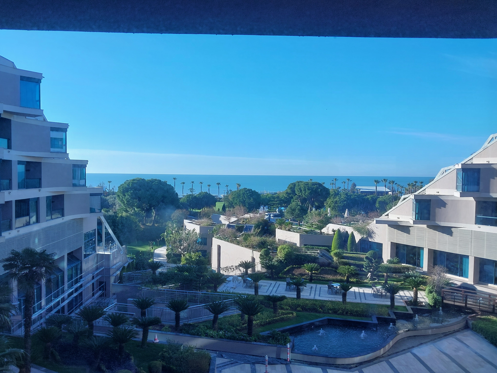
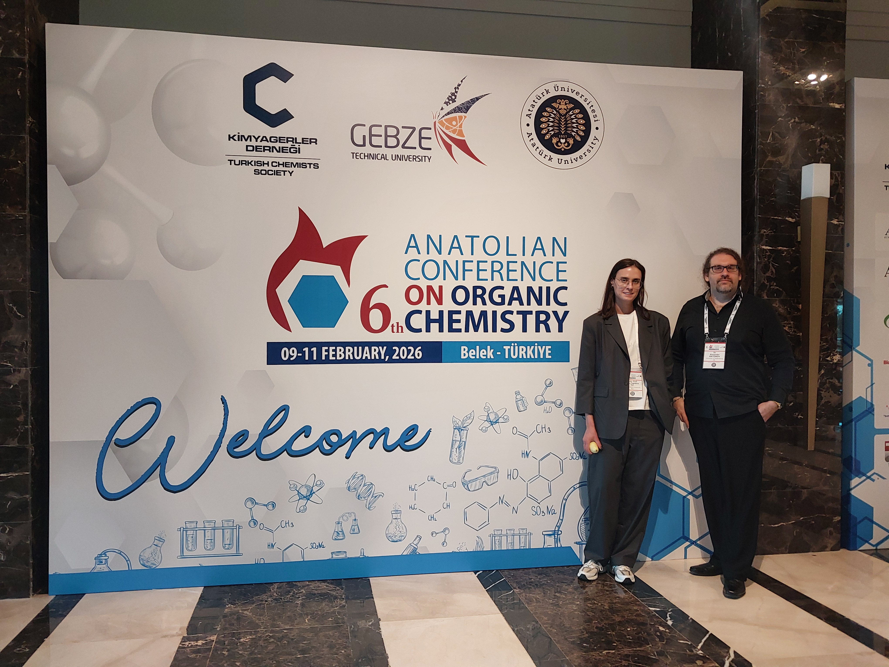

Dr. Antonov attended the **6th Anatolian Conference on Organic Chemistry (ACOC6)** in **Antalya, Türkiye**, held **February 09–11, 2026** at the **Susesi Luxury Resort** as invited speaker with a talk "H-bond Assisted Sterically Facilitated Construction of Nitrogen Heterocycles". :contentReference[oaicite:2]{index=2}

## Links
- Conference website: https://anatolianorgchem.org/ :contentReference[oaicite:4]{index=4}

## Photos

