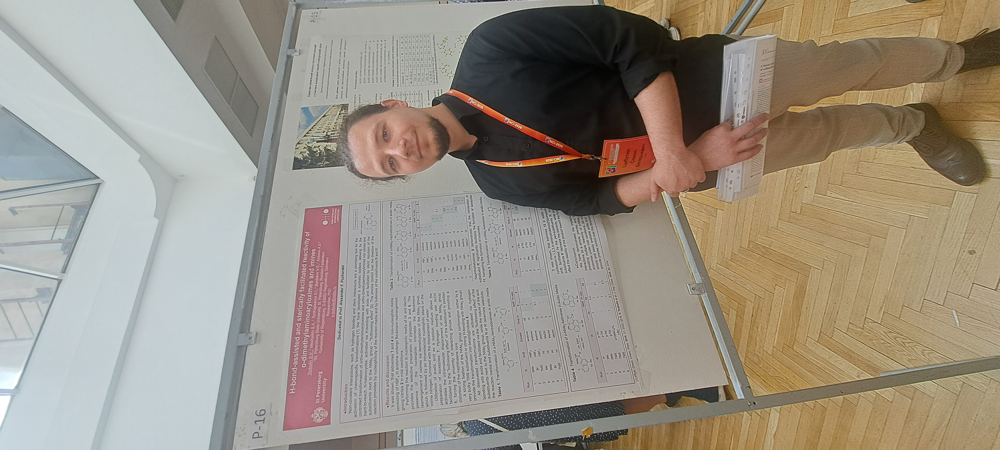
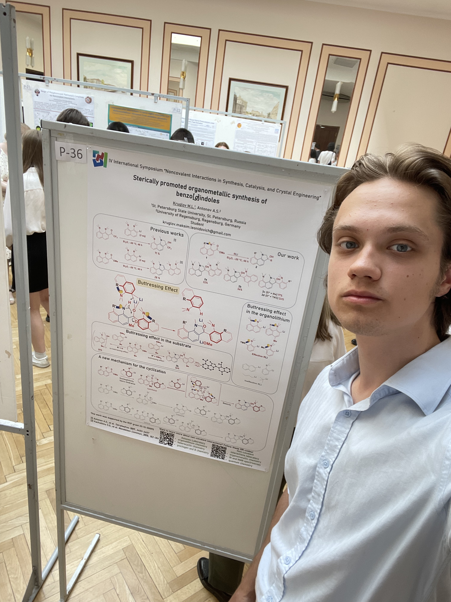
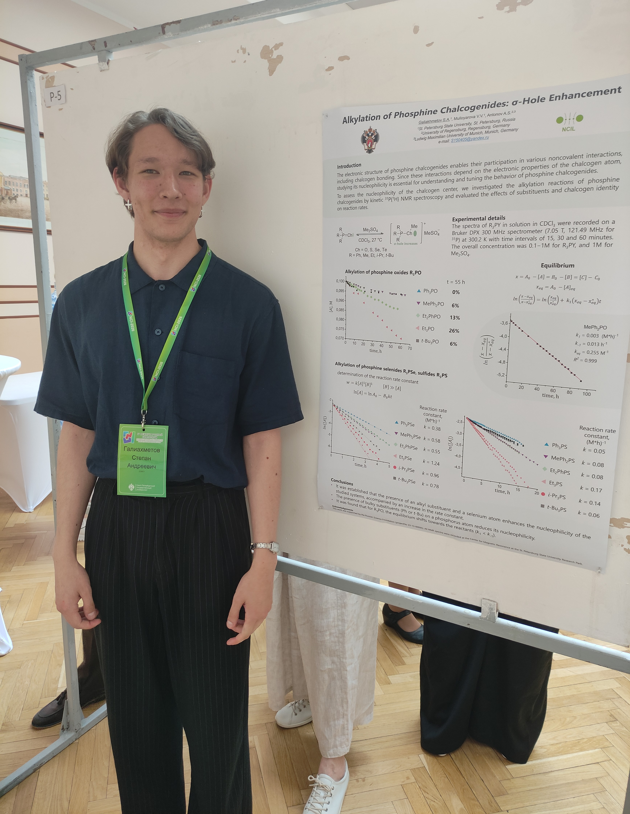

AntonovLab at the IV International Symposium “Noncovalent Interactions in Synthesis,
Catalysis, and Crystal Engineering” (NCI-2026). This year in beautiful Saint Petersburg.
-	Dr. Semyon Tsybulin presented our recent achievements in H-bond-assisted transformations of oximes and imines into heterocycles.
-	Maksim Kruglov shared preliminary results of our ongoing project on the organolithium mediated synthesis of indoles.
-	Stepan Galiakhmetov demonstrated our novel approach for the enhancement of sigma-holes in phosphine chalcogenides.

## Links
- Conference website: https://events.spbu.ru/nci-2026-en

## Photos

